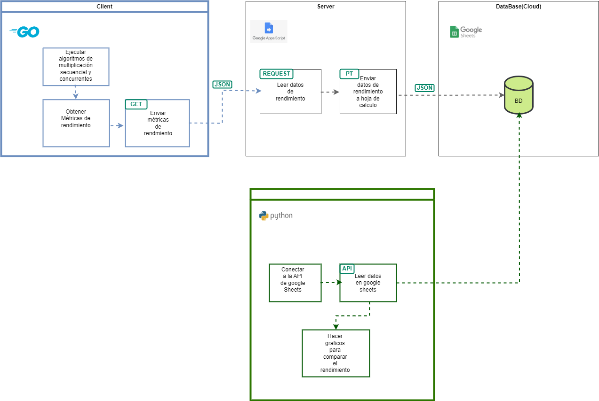
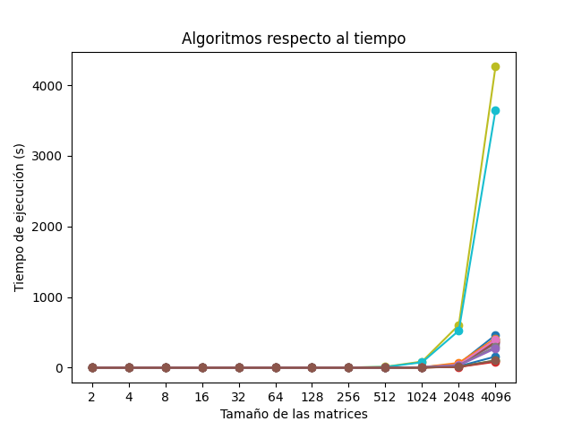

# Proyecto de Multiplicación de matrices en Go

Este proyecto usan las siguientes tecnologias:

- Go
- Appsscript
- Google Sheets
- Python - Pandas - Numpy - matplotlib

El objetivo de este proyecto es implementar diferentes algoritmos de multiplicación de matrices para analizar su rendimiento a través de gráficas.
Entre los algoritmos implementados están secuenciales y concurrentes con el uso de Go rutinas 

En el siguiente diagrama de componentes se puede observar las relaciones entre las partes como componen el proyecto

Con ayuda del siguiente grafico se concluye que los algoritmos concurrentes son mas eficientes:

